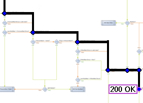

Webmachine is not much like the Web frameworks you're used
to. You can call Webmachine a REST toolkit if you like, and we
won't argue with you.

Webmachine is an application layer that adds HTTP semantic
awareness on top of the excellent bit-pushing and HTTP
syntax-management provided by
[mochiweb](http://github.com/mochi/mochiweb),
and provides a simple and clean way to connect that to your
application's behavior.

A Webmachine application is a set of resources, each of which is a set of
[functions](resources.html) over the state of the
resource. We really mean functions here, not object-methods,
infinite-server-loops, or any other such construction. This
aspect of Webmachine is one of the reasons why Webmachine
applications are relatively easy to understand and extend.

These functions give you a place to define the representations
and other Web-relevant properties of your application's
resources -- with the emphasis that the first-class things on
the Web are resources and that their essential properties of
interaction are already quite well defined and usefully
constrained.

For most Webmachine applications, most of the functions are
quite small and isolated. One of the nice effects of this is
that a quick reading of a resource will give you an
understanding of the application, its Web behavior, and the
relationship between them. Since these functions are
usually [referentially transparent](reftrans.html),
Webmachine applications can be quite easy to test. There's no
need for mock objects, fake database connections, or any other
wastes of time when you can write tests against each component
of your application in terms of the input and output to
various functions.

We believe that by giving Web developers a
[system](mechanics.html) with conventions that
[directly map to HTTP](diagram.html) and REST, we
help them to write and extend Web applications quickly while
not dictating the shape of the rest of their application. The
resulting applications are straightforward to examine and
maintain, and have very easily understood HTTP semantics.

### more information
* [introduction](intros.html)
* [documentation](docs.html)
* [other writing](blogs.html)

